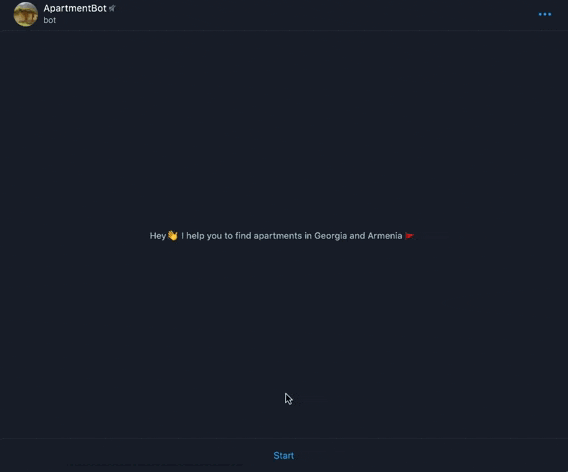

# Apartment Bot
A Telegram Python bot for searching apartments in Georgia and Armenia.

### Getting Started
1) Send a '/newbot' command to @BotFather and name your bot, e.g. ApartmentBot
2) Choose a username for your bot. It must end with 'bot', e.g. apartment_bot   
3) Copy HTTP API token and insert it in 'setting.py'. Save the token as 'BOT_TOKEN'

### Prerequisites
All the modules for successful work are in 'requirements.txt'.  
Run the following command in CMD/Console to install:
```
pip install -r requirements.txt
```

### Installing
Open a terminal and go to the directory you need.  
Enter the command:  
```
git clone git@github.com:aliksandrion/apartment_bot.git
```
Enter the next command:
```
python3 -m venv venv
source venv/bin/activate
cd MyBlog
pip install -r requirements.txtt
```
Create a file 'settings.py' and insert 'BOT_TOKEN' from @BotFather.  
Its structure should be the following:
```
BOT_TOKEN = '0123456789:AaBbCcDdEeFfGgHhIiJjKkLlMmNnOoPpQqR'
```
In the 'settings.py' insert these parameters:
```
HEADERS = {'User-Agent': 'Mozilla/5.0 (Macintosh; Intel Mac OS X 10_15_3) AppleWebKit/537.36 (KHTML, like Gecko)'
                         'Chrome/80.0.3987.149 Safari/537.36'}
                         
CITY_CODE = {
    'tbilisi': 'Tbilisi?Keyword=Tbilisi&AdTypeID=3&PrTypeID=1&cities=1996871&GID=1996871&WithPhoto=1',
    'batumi': 'Batumi?Keyword=Batumi&AdTypeID=3&PrTypeID=1&cities=8742159&GID=8742159&WithPhoto=1',
    'yerevan': '&n=1',
    'gyumri': '&n=51',
}
```
'HEADERS' ensures avoiding server blocks.
'CITY_CODE' specifies url-requests to websites.

### Built With
* [pyTelegramBotAPI](https://github.com/eternnoir/pyTelegramBotAPI) - interface created for developers keen on building Telegram bots.
* [beautifulsoup4](https://www.crummy.com/software/BeautifulSoup/) - scraping information from web pages.
* [requests](https://pypi.org/project/requests/) - enables the developer to send HTTP/1.1 requests.

### Links of author

[Git](https://github.com/aliksandrion)  
[LinkedIn]()